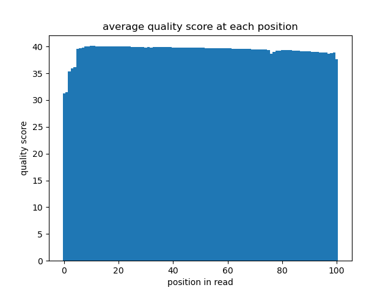
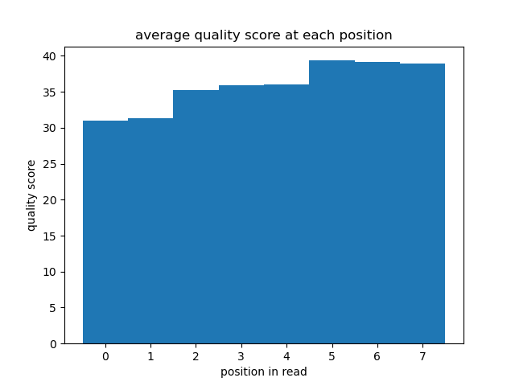
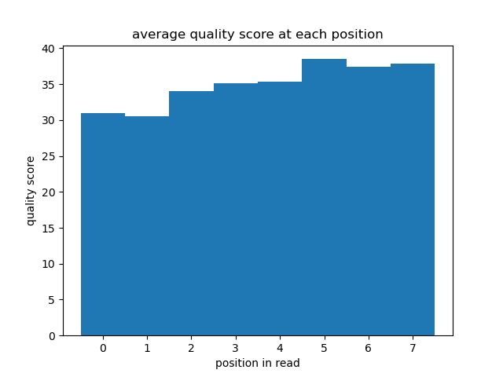
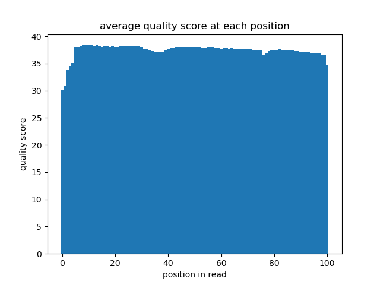

# Assignment the First

## Part 1
1. Be sure to upload your Python script.

| File name | label | Read length | Phred encoding |
|---|---|---|---|
| 1294_S1_L008_R1_001.fastq.gz | R1 | 101 | Phred+33 |
| 1294_S1_L008_R2_001.fastq.gz | I1 | 8 | Phred+33 |
| 1294_S1_L008_R3_001.fastq.gz | I2 | 8 | Phred+33 |
| 1294_S1_L008_R4_001.fastq.gz | R2 | 101 | Phred+33 |

2. Per-base NT distribution
    1. Use markdown to insert your 4 histograms here.
    
    
    
    
    
    2. - Index read quality filter: 30 (Phred+33: >) will probably be sufficient. Any index with N will be put in unknown, but we want little chance of good reads being put in unknown. Raising the cutoff could be good, but we would be increasing the number of good reads put in unknown.
        - Biological read quality filter: 30 (Phred+33: >) A 0.1% error rate seems plenty low enough for reads, especially as the end user would probably perform their own filtration or trimming. Lowering this would probably be fine.
    3. - R2: `zcat 1294_S1_L008_R2_001.fastq.gz | sed -n 2~4p | grep -c N` 3976613 indexes have N
        - R3: `zcat 1294_S1_L008_R3_001.fastq.gz | sed -n 2~4p | grep -c N` 3328051 indexes have N
    
## Part 2
1. Define the problem
2. Describe output
3. Upload your [4 input FASTQ files](../TEST-input_FASTQ) and your [>=6 expected output FASTQ files](../TEST-output_FASTQ).
4. Pseudocode
5. High level functions. For each function, be sure to include:
    1. Description/doc string
    2. Function headers (name and parameters)
    3. Test examples for individual functions
    4. Return statement
